# Hi there, I'm Kyrylo

Web developer building responsive, well-structured websites - from Figma design to finished, working site. Landing pages, multi-page business sites, e-commerce, and portfolios.

**Tech Stack:** HTML · CSS (SCSS) · JavaScript · OpenCart · WordPress

**Tools:** Google Chrome · Adobe Photoshop · Visual Studio Code · Git · Microsoft Office · Pixso · Figma

I will do everything possible and utilize all my skills to ensure you are satisfied with my work.

I look forward to assist you in bringing your wonderful projects to life.
___

### Thank you for your order!

I will be glad to have a good response.  Contact yet!

### My contacts:

[Mail: kirillchacha2000@gmail.com](mailto:kirillchacha2000@gmail.com) 
[linkedin](https://linkedin.com/in/kirill-chacharskyi-3a658225a/)

See more projects on my **[portfolio](https://kirillchacha.github.io/portfolio/)**.

## Currently

Taking on more ambitious projects.

Sincerely, Kyrylo Chacharskyi🤝
